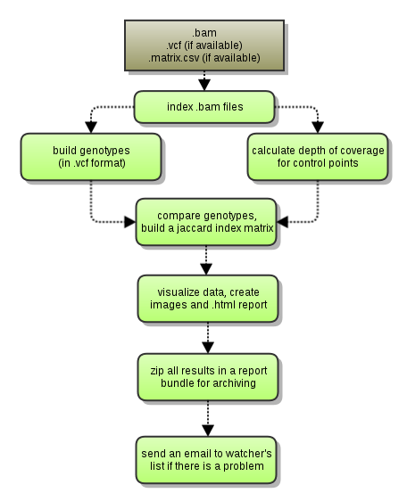
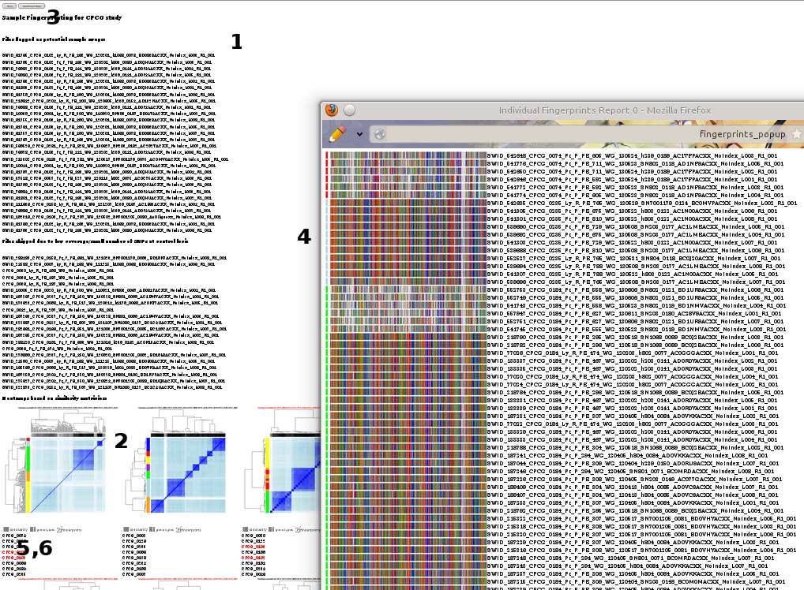

## sample-fingerprinting workflow

Version 2.0.2

### Overview

Sample Fingerprinting workflow produces a graphical report on genotype clustering by sample (donor) and sends alerts if there's a possible swap/mix-up detected. It uses .vcf .tbi and .fin files produced by FingerprintCollector workflow. The below graph describes the process:



### Dependencies

This workflow requires:

* [SeqWare](http://seqware.github.io/)
* [tabix](http://sourceforge.net/projects/samtools/files/tabix/) 0.2.6
* [vcftools] (http://vcftools.sourceforge.net/) 0.1.10

### Compile

```
mvn clean install
```

### Usage
After compilation, [test](http://seqware.github.io/docs/3-getting-started/developer-tutorial/#testing-the-workflow), [bundle](http://seqware.github.io/docs/3-getting-started/developer-tutorial/#packaging-the-workflow-into-a-workflow-bundle) and [install](http://seqware.github.io/docs/3-getting-started/admin-tutorial/#how-to-install-a-workflow) the workflow using the techniques described in the SeqWare documentation.

#### Options
These parameters can be overridden either in the INI file on on the command line using `--override` when [directly scheduling workflow runs](http://seqware.github.io/docs/3-getting-started/user-tutorial/#listing-available-workflows-and-their-parameters) (not using a decider). Defaults are in [square brackets].

Required:

    study_name                string      A required parameter passed by the decider
                                          or on the command line if workflow is launched
                                          manually

Input/output:

    output_prefix             dir         The root output directory
    output_dir                string      The sub-directory of output_prefix where 
                                          the output files will be moved
    manual_output             true|false  When false, a random integer will be 
                                          inserted into the path of the final file 
                                          in order to ensure uniqueness. When true,
                                          the output files will be moved to the 
                                          location of output_prefix/output_dir
                                          [false]

Optional:

    data_dir                  dir         A standard SeqWare parameter specifying the
                                          sub-directory where the output files will 
                                          be staged
    checked_snps              string      path to the vcf file (bgzipped and tabix-indexed)
                                          that contains coordinates and ids of dbSNPs
                                          used to genotype .bam files
    check_points              int         Number of snps in 'checked_snps' file
    exisiting_matrix          string      A file with previously calculated jaccard indexes 
                                          (recycled from previous runs to speed up calculations)
                                          Should be passed by the decider if available
    watchers_list             string      A comma-delimited list of emails 
                                          (of those who are interested in monitoring 
                                          SampleFingerprinting workflow runs)
    mixed_coverage            string      Parameter tells SampleFingerprinting workflow to
                                          use .fin files for calculation of similarities
                                          between the analyzed samples
    queue                     string      Name of the (SGE) queue to schedule to [production]

#### Building similarity matrix

This step uses a wrapper perl script (jaccard_coeff.matrix.pl) which calls vcftools executable vcf-compare. Vcf files are analyzed for overlap and then we calculate Jaccard index that gets recorded into the matrix and uses as a measurement of similarity between two genotypes. The Jaccard coefficient is defined as the [number of matches]/[total number of loci with enough coverage] in a two-sample comparison.

We have two slightly different ways to calculate similarities. The default (older of the two) method is using vcf files made with FingerprintCollector and counts the number of matching SNPs. The newer algorithm which is disabled by default analyzes .fin files and while counting SNPs it also takes the number of matching 'M's in account. The later allows to somewhat boost the numbers for samples with a low number of SNPs and as practice shows, helps to better separate such samples from the ones with low coverage. It is important to note that theoretically we may encounter two samples with no matching SNPs and a few matching 'M's. In this case the Jaccard coefficient will be zero since counting REF-matching bases is possible only if there at least few matching SNPs are also present. This logic disallow grouping samples for which we do not have any polymorphism (and therefore, no any identifying information).

#### Producing the HTML report

make_report.pl is doing the bulk of the job by clustering data (using R scripts) and identifying potential swaps. This script produces several output files, most notably - heatmaps for lanes grouped together based on their similarity. The heatmaps organized in a html report (index.html), which also provides links for downloading similarity matrices and genotype tables for each of the heatmaps. The report may be further customized using our webtool (needs to be deployed on a webserver).

### Marking swaps

The algorithm that marks potentially swapped samples relies on an assumption that samples from the same donor will be grouped together by clustering. The script (make_report.pl) launches a clustering script and then parses the dendrogram that this script produces. The algorithm starts from the root of the dendrogram and starts splitting (chopping) this tree until all donor-specific samples are sitting on separate branches. In case when a sample sits outside the branch which holds all the other samples from the same donor a swap will be called and all the samples from this donor will be marked.



The HTML Report contains the following:

    List of potential swapped samples
    Heat maps for each set of very similar samples
    Link to download the Project (Study) Similarity Matrix CSV file
    Genotype barcodes of all files in a heatmap
    Similarity matrix describing the proximity of all files in a heatmap
    Link to Genotype CSV (for each heatmap)
    
#### Sending Alerts

There is a small script plotReporter.pl that sends alerts notifying about potential sample swaps detected by this workflow. A comma-delimited list of emails should be assigned to parameter watchers_list. The scripts rely on make_report.pl script that inserts special flags into .html report. plotReporter.pl detects these tags and sends out emails with generic text and location of the result bundle.

### Output files

**sample_fingerprint.[StudyName].report.zip**
Contains index.html with Sample Swap report, similarity matrix files, heatmaps of clustered samples in png format

### Support

For support, please file an issue on the [Github project](https://github.com/oicr-gsi) or send an email to gsi@oicr.on.ca .
